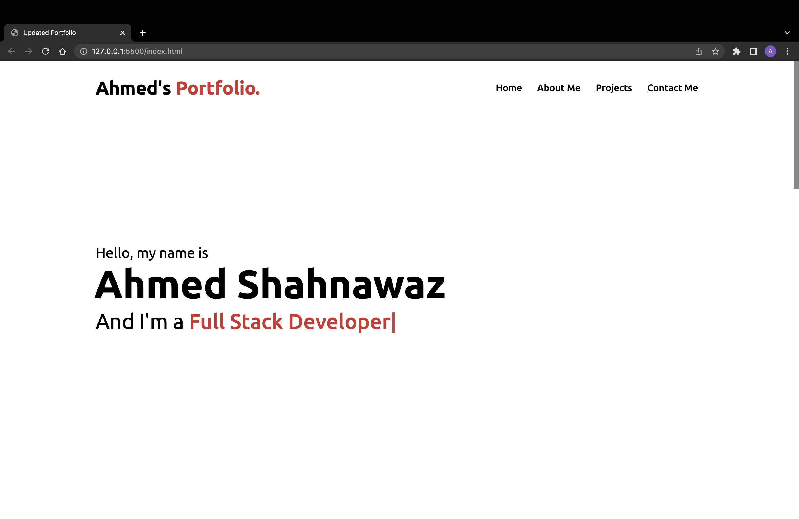

# Updated-Portfolio-Page-2

## Internal Changes:

Internally (within the code), I have utilised my existing portfolio. However, I have updated numerous things within it. For instance, I have included links to my:

1. LinkedIn profile.
2. GitHub profile.
3. Email Address and Phone number.

I have also updated the "my projects" section to meet the requisites for the homework which were both projects coupled with a minimum of 4 pieces of homework that had to be displayed. Additionally, for each project I have displayed I have entitled them and entwined them with their respective deployment link and GitHub repository. Finally, I have updated the CV within the application.

## External Changes:

Due to the updated portfolio, I have also updated external factors such as my LinkedIn page alongside my CV. I have also refactored some old code to make it look more readable thus making it more professional. Furthermore, I have updated my GitHub page. For example, on GitHub, I have changed my pinned repositories to include both my projects and 4 A+ graded pieces of homework.

## Preview:

  

## Deployed URL:

https://ahmeds226.github.io/Updated-Portfolio-Page-2/
